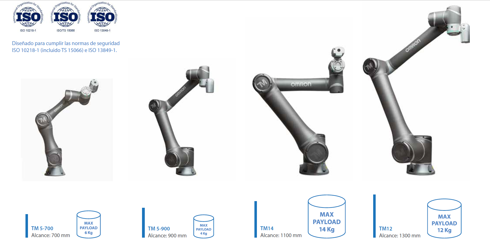
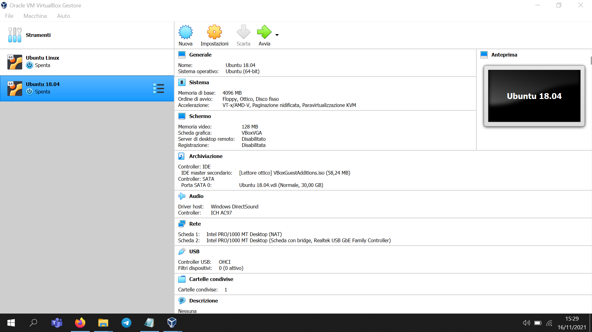
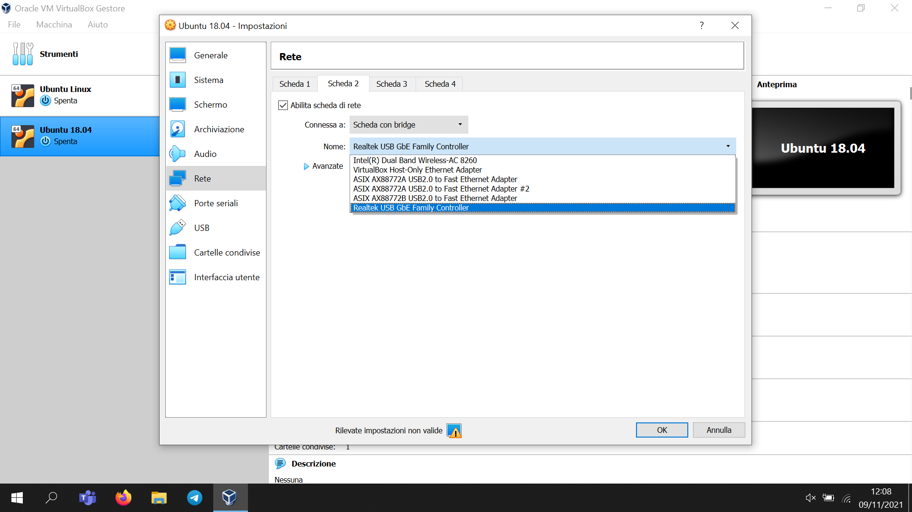
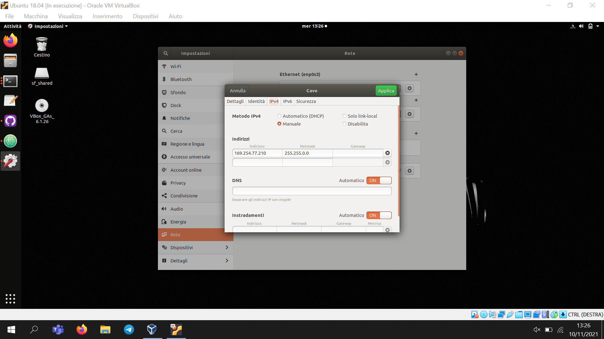
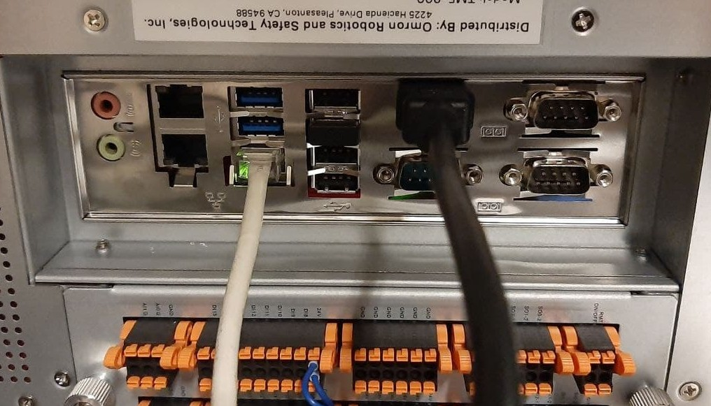
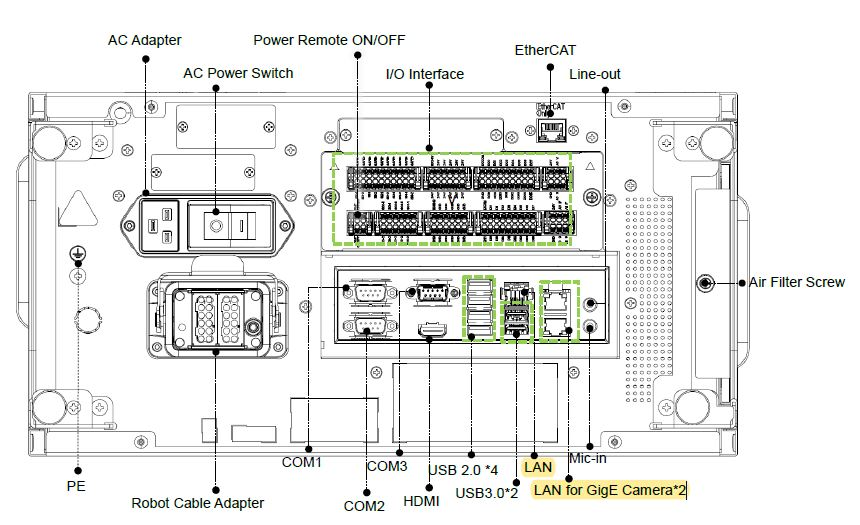

# __Omron TM robots ROS user guide__

This repo has been forked from [TechmanRobot]( https://github.com/TechmanRobotInc/tmr_ros1), which provides the driver to connect with the physical robot, for any issue regarding the ROS driver refers to techman robot page. <br>
The additional packages you will find in this repo have been developed in collaboration with the Robotics team of the 
&nbsp [](https://industrial.omron.eu/en/home) &nbsp; __ATC Barcelona__ during my PhD visiting period. <br/>
This repo has been developed and tested using the __TM5-700__ and __TM12-1300__ with __TMFlow 1.84.2200__ , with __ROS Melodic__, __MoveIt__, __Gazebo 9.19.0__ under __Ubuntu 18.04__.<br/>


## &sect; __How to navigate into this Repository__
The __tmr_ros1__ folder is a metapackage containing the driver, standard msgs and urdf description folders of the TM Omron robots. <br>
:bulb: With respect to the original TM driver here some urdf files has been changed to match with some specific applications (check __tm5_700_gripper_description__ and __tm12_description__). <br>
The other pkgs outside the metapkg has been developed to analyse and simulate specific applications with __TM5-700__ and __TM12-1300__ robots. 
In particular the pkg __tm5_700_gripper_moveit_config__ has been developed to work with __TM5-700__ robot and __Robotiq_85__ gripper using MoveIt Python API and Gazebo simulator. While __tm12_palletizer_moveit_config__ pkg has been developed to work with __TM12-1300__ and __Schmalz_omron_spb2__ vacuum gripper using as well MoveIt Python API and Gazebo simulator.
<br>

## __1.What the ROS Driver does?__

The existing TM ROS driver is a __single ROS node__ that handles robot(TMFlow)-pc(ROS) communication through an ethernet cable (rj45), implementing the TCP/IP communication protocols described in [espression_editor](src/documents/tm_expression_editor_and_listen_node_manual.pdf).  In details the driver connects to _TMflow Ethernet Slave_ and to a _Listen node_ running at a _TMflow project_. Thanks to this the user can get the robot state and can control the robot using _External Script_. <br/>
The TM ROS driver node offers different interfaces (Topic/Service), for firther details please refers to the Readme file in [tmr_ros1]( https://github.com/TechmanRobotInc/tmr_ros1).

## __2. Setup__
In this part is explained step by step how to establish a connection with the Robot's Listen Node and start the communication.<br/>

### &sect; __Omron TM robot setting__
1) Download and upload on the robot the "Data_Table_Setting_TM_ROS_Default.xml", a file from which is possible to select the R & W variables accessible from the controller. 

$ cd ~/Desktop
$ git clone https://github.com/TechmanRobotInc/TM_Export

2) Place the downloaded component in a USB stick labeled "TMROBOT", insert the USB in the robot controller then on TM flow navigate to => System => Import/Export in order to import the component onto the robot. (follow the steps here if necessary [how to insert the USB flash drive to the Control Box](https://github.com/TechmanRobotInc/TM_Export))

3) Shutdown the robot.

### &sect; __Ubuntu 18.04 Virtual Machine setup__
If necessary create a virtual machine with __Ubuntu 18.04__ (Bionic). The steps to create the virtual machine with VirtualBox can be found in [Ubuntu](https://www.toptechskills.com/linux-tutorials-courses/how-to-install-ubuntu-1804-bionic-virtualbox/). <br/>

To allow the TCP/IP connection with the robot it is required to modify the default network settings.  <br/>
The default virtual network adapter uses __NAT__ (Network Address Translation) mode.
With this mode the guest operating system can access external networks, including the internet, but the guest machine is not accessible from the outside.



So a new virtual network adapter that uses __Bridged Adapter__ must be enabled. With this mode packets are sent and received directly from/to the virtual network adapter without additional routing so that the VM can be accessed from other hosts connected to the physical network.<br/>
The correct network adapter must be selected (the physical adapter used for the connection with the robot).



Finally a proper __static IP__ address must be assigned to the VM so that the VM and the robot belong to the same __private network__.



###  &sect; __Physical connection to TM ROBOT__
The robot and the pc must be physically connected through an __ethernet cable__ (rj45). <br/>
:bulb:__WARNING__ Connect the ethernet cable to the __LAN__ port of the control box.

<p align="center">
  
&nbsp; &nbsp; &nbsp; &nbsp;
  
</p>

### &sect; __TMFlow setup__
On the robot side the steps to enable the communication are the following:

1. Create a new TMFlow project with an infinite loop on a __Listen__ node. Just drag the node from the _nodes menu_, the node parameters can be left to their default value.


2. Run the TMFlow project on the robot side and open a terminal on the pc side. <br/>
Check the robot-pc connection with a __ping__ to the robot ip address.

 

## __3. Usage__
After following all the steps described in section 2, is possible to use functionalities of these pkg running the following __launch file__ and __nodes__.

__Test_1__
Visualize tm5_700 with robotiq 85 gripper in rviz. <br>
```bash
$ roslaunch tm5_700_gripper_moveit_config demo.launch
```
__Test_2__
Use the tm5_700 with robotiq 85 gripper in Rviz and Gazebo, and test the OmronTMRobot Python class to plan path. <br>
1. Run in the first shell:<br>
```bash
$ roslaunch tm5_700_gripper_moveit_config tm5_700_robotiq_gazebo_moveit.launch
```
Create automatically collision objects in the Rviz scene and publish them to the planner.<br>
2. run in a second shell:
```bash
$ rosrun omrontm_python_move_interface tm5_700_boxes_scene.py
```
Create Automation with Python API giving logics, simulate grasping and plan trajectories avoiding obstacles.<br>
3. run in a third shell:
```bash
$ rosrun omrontm_python_move_interface TestTMclass_tm5_700.py
```

__Test_3__
Use the real tm5_700  to plan trajectories with the OmronTMRobot Python class. <br>
1. run in the first shell:
```bash
$ roslaunch tm5_700_moveit_config tm5_700_moveit_planning_execution.launch
```
2. run in a second shell:
```bash
$ rosrun omrontm_python_move_interface TestTMclass_tm5_700_real_robot.py
```

